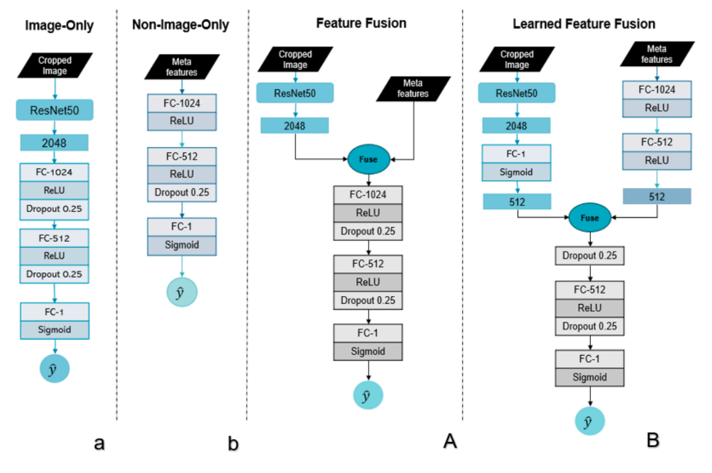

# Evaluating the Role of Multimodal Clinical Data in Breast Cancer Diagnostic Classifier

## Overview
  - [Evaluating the Role of Multimodal Clinical Data in Breast Cancer Diagnostic Classifier](https://github.com/paulYRP/bis-endtoend-approach/blob/main/bis-endtoend-approach.pdf)

### Workflow


### Diagram



--------------

## Project Abstract

The process of diagnosing breast cancer is fundamentally multimodal in nature. In real-life clinical scenarios, physicians utilise mammography scan images and clinical information to assess cancer. With advances in artificial intelligence, technology is being increasingly integrated into healthcare to support human decision-making. Despite this, several seminal deep learning approaches for breast cancer classification are primarily based on using image or non-image textual clinical data only, without effectively integrating both modalities. Using an established study as a reference, this project compared the diagnostic classification performance of unimodal and multimodal approaches, with the aim of gaining insights into how the performance of a classifier changes when image-level data is combined suitably with non-image clinical data. This project made use of the CBIS-DDSM dataset, which comprises 6,671 breast images from 1,566 participants. Key sampling and preprocessing steps, such as binary encoding and image preprocessing, including pixel value extraction and normalisation, were implemented. Subsequently, the breast images were linked with relevant non-image features, including breast density, mass shape, and calcification type. Unimodal baseline models based on image and non-image data were trained first, following which, the two models with distinct modality fusion strategies were trained. The assessment was conducted using the area under the receiver operating characteristic curve (AUC) and specificity at 95% sensitivity. In the most optimal iteration of the image-only model, an AUC of 0.53 (95% CI: 0.47, 0.6) and a specificity at 95% sensitivity of 10% were achieved. In contrast, the top-performing non-image-only model iteration achieved an AUC of 0.74 (95% CI: 0.67, 0.79) and a specificity at 95% sensitivity of 29%. The finest feature fusion model attained an AUC of 0.67 (95% CI: 0.6, 0.73) with a specificity at 95% sensitivity of 17%. Notably, the learned feature fusion model surpassed the feature fusion model, achieving an AUC of 0.74 (95% CI: 0.68, 0.8) and a specificity at 95% sensitivity of 26%. 

## Usage

### 1. Data Preparation <br/>
`data_preparation.ipynb` was used to prepare non-image features including feature selection and one-hot encoding, merge non-image and image data sources, perform stratified sampling and train test splits, and finally export data including ID references and meta feature names to the `\dataset` directory in the following file structure:
```bash
├── dataset
│   ├── train
│   │   ├── 1_x_cropped.npy
│   │   ├── 1_y.npy
│   │   ├── 1_meta.npy
│   │   ├── ...
│   ├── val
│   │   ├── 1_x_cropped.npy
│   │   ├── 1_y.npy
│   │   ├── 1_meta.npy
│   │   ├── ...
│   ├── test
│   │   ├── 1_x_cropped.npy
│   │   ├── 1_y.npy
│   │   ├── 1_meta.npy
│   │   ├── ...
│   ├── id_reference_test.txt
│   ├── id_reference_train.txt
│   ├── id_reference_val.txt
│   ├── meta_header.txt
```
where `*_x_cropped.npy` contains a raw cropped image of shape `(h, w)`, `*_y.npy` contains the associated target of shape `(1,)`, `*_meta.npy` contains the associated non-image data of shape `(n_features,)`, `id_reference_*.txt` contains the ID references per associated dataset and `meta_header.txt` contains the column names the final one-hot encoded non-image features.

### 2. Executing Pipelines <br/>

Assuming you have Anaconda installed, run `conda env create -f mri_fusion.yaml` to install all pre-requisites. The pipeline used for this work was simply to normalize and resize the image data (`pre_process.py`) and train models (`train.py`); you can find the specific commands to conduct all experiments in `run_experiments.bat` containing five experiments for each model at different number-generating seeds. After training, we conducted a feature importance analysis (`feature_imp.py`) to understand the contribution of each non-image features to the breast cancer prediction. Lastly, `plotROC.ipynb` was used to produce the combined ROC curves for the best run and five-run ensemble. All the experimental results for the two unimodal baselines and Learned Feature Fusion and Feature Fusion can be found in `results/` directory. 

To execute the experiments, simply run `train.py` with the arguments of your choice. Below is an example of training the Learned Feature Fusion model on the dataset with the settings used in the project using default values for most arguments (refer to `train.py` for more default values):
```python
python train.py --data_dir <path_to_your_dataset> \
                --out_dir <path_to_results> \
                --model learned-feature-fusion \
                --seed 0  
```
Example to run the learned feature fusion on the above trained model:
```python
python feature_imp.py   --model learned-feature-fusion
                        --model_name learned-feature-fusion-concat_no-CW_aug_seed0
```

## Reference
```bash
Author: Si Man Kou (N11200855), Paul Yomer Ruiz Pinto (N10962646)
Last Modified: 5/11/2023
Code adapted from https://github.com/gholste/breast_mri_fusion/tree/main which is licensed under MIT License permitting modification and distribution.
```
